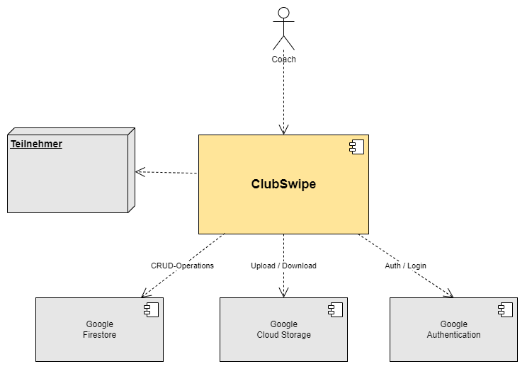
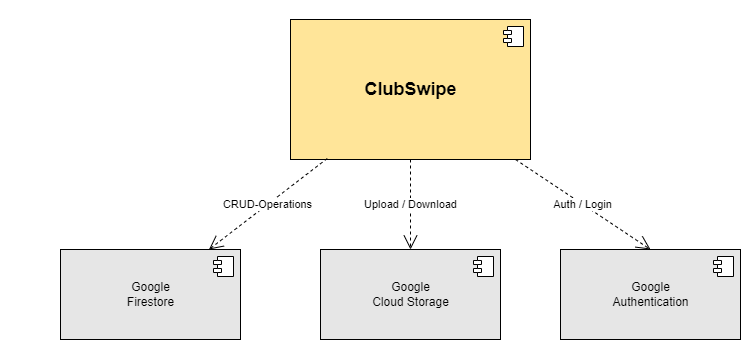

[[section-system-scope-and-context]]
== Kontextabgrenzung

=== Fachlicher Kontext

#### Teilnehmer
Der Teilnehmer wird als Objekt in ClubSwipe verwendet. Pro Teilnehmer wird geprüft ob er für ein bestimmtes Training an- oder abwesend ist.

#### Coach
Der Coach bedient die Applikation und prüft während eines Trainings die Anwesenheiten aller Teilnehmer. Er kann in der App auch Absenzen erfassen. 

#### Google Firestore
Google Firestore sammelt und verwaltet die erfassten Daten der Applikation und hält sie zwischen den verschiedenen Anwendern synchron.

#### Google Authentication
Prüft die Authentizität eines Anwenders und verwaltet die Berechitung und Login-Freigabe der einzelnen Anwender.

==== Technischer Kontext

#### Google Firestore
Google Firestore biete CRUD-Operationen für die Verwaltung von Dokumenten und Collections von Dokumenten.

#### Google Authentication
Google Authentication führt die Authentifikation eines Anwenders durch und prüft den Zugang zu den Daten der Andwender.