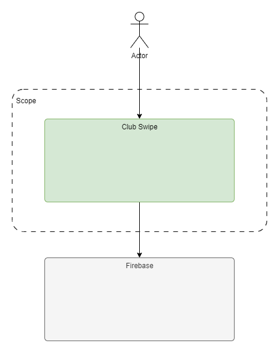
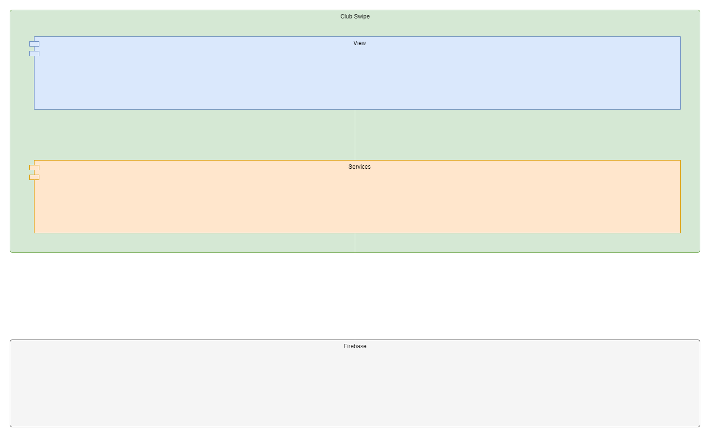
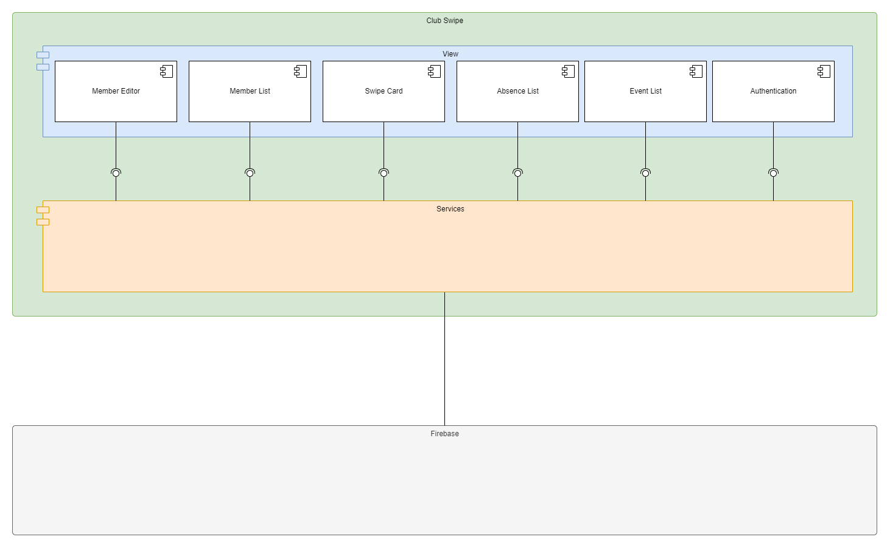
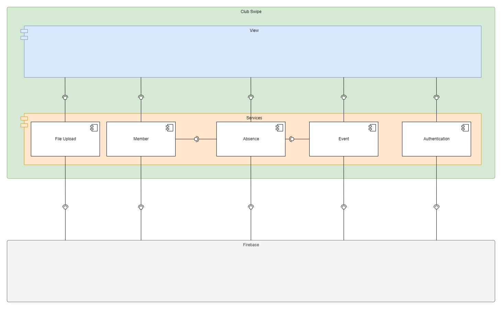
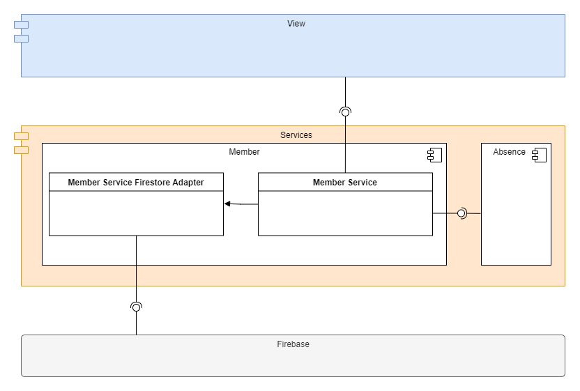
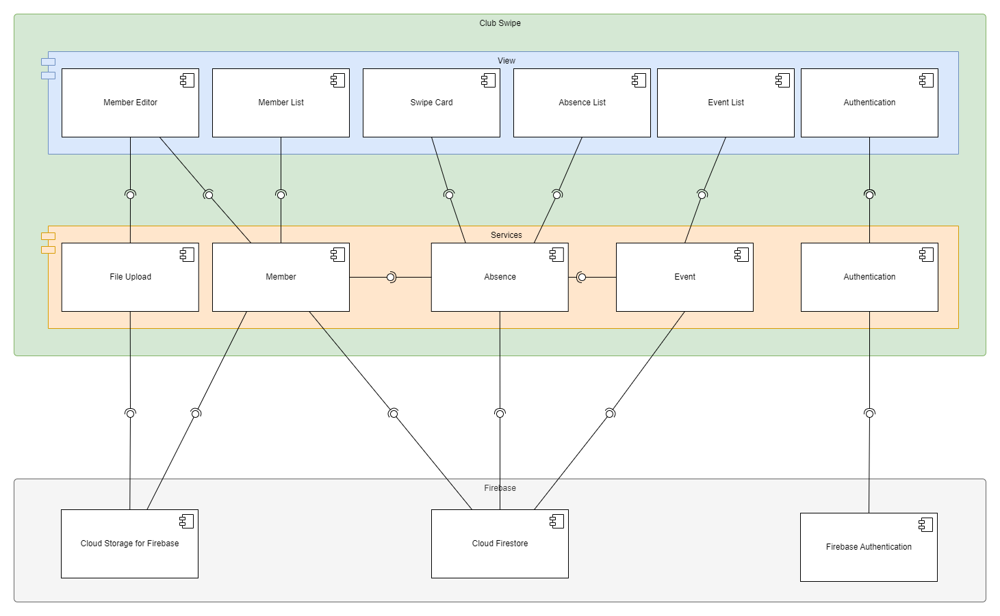

[[section-components]]
== Komponenten
Folgende Abschnitte beschreiben einzelne Komponenten nach dem C4-Modell. D.h. es wird von der High-Level Perspektive ausgegangen und mit den weiteren Levels tiefer abgetaucht (top-down). 

=== Level 1
Das folgende Diagramm zeig die beiden Hauptkomponenten der ClubSwipe-App. Das ist einerseits Firebase als Persistenz Provider für das App und andererseits die Clubswipe ab. 

=== Level 2
Die ClubSwipe App besteht aus zwei Schichten. Das sind View und Services. Die View kümmert sich um die Aufbereitung und Darstellung der Daten. Hingegen beinhaltet die Service Schicht die Geschäftslogik der App. 

=== Level 3

==== View Komponente
Nachfolgend ein kurzer Beschrieb der einzelnen Views: + 
**Member Editor:** UI für die Erfassung und Bearbeitung eines Teilnehmers. + 
**Member List:** Listenansicht aller Teilnehmer mit Suchfunktion inklusiv Menüs für weitere Funktionen + 
**Swipe-Card:** UI-Komponenten für die Ermittlung der Anwesenheit eines Teilnehmers an einem Event. Sie stellt Fotos der Mitglieder dar. Mit einem Swipe nach rechts kann die Anwesenheit bestätigt werden. Mit einem Swipe nach links wird diese abgelehnt. + 
**Absence List:** In dieser Sicht können die Absenzen in einer Listenansicht bearbeitet werden.  + 
**Event List:** Liste aller Events mit Menüs zur Verwaltung + 
**Authentication:** Login-Maske + 

==== Service Komponente
**File Upload:** Dient dem Upload von Profilbilder auf Google Cloud Storage + 
**Member:** Verwaltung und Abfrage von Teilnehmer + 
**Absence:** Geschäftslogik zur Absenzen Führung und Abfrage  + 
**Event:** Verwaltung von Events und Event-Teilnahmen + 
**Authentication:** Adapter Service für Google Authentication. Bereitstellung der Loginfunktionalität. + 

=== Level 4
**Member Service Firestore Adapter:** Adapter zu Google Firstore Datenbank. Durch die Abstraktion der Datenbank, soll es relativ einfach sein, auf eine andere Datenbank wechseln zu können. + 
**Member Service:** Bietet CRUD Operationen für Teilnehmer.  + 
**Absence:** Für die Absenzen Führung braucht es Teilnehmer. Aus diesem Grund hat dieser Service eine Abhängigkeit zu Member Service. + 

=== Gesamtübersicht

