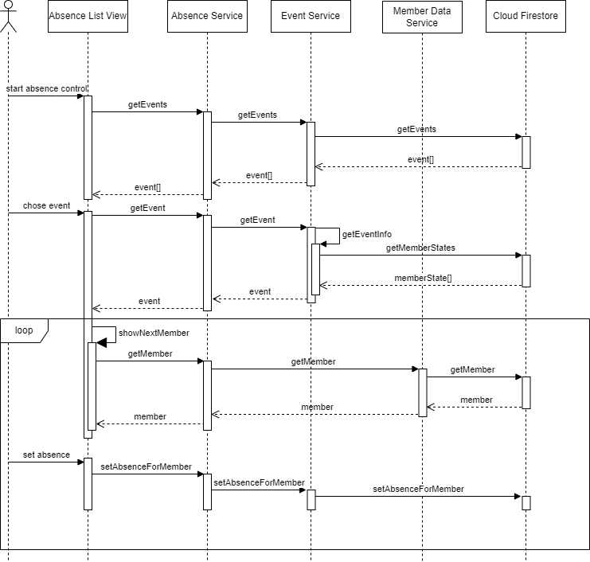

[[section-runtime-view]]
== Laufzeitsicht

=== _Anwesenheitskontrolle_
Das Sequenzdiagramm beschreibt den Ablauf des Use Case Anwesenheitskontrolle. Bei diesem Use Case geht es darum, dass der Benutzer für jeden Teilnehmer des aktuellen Trainings entscheiden muss, ob dieser anwesend ist. Das Diagramm zeigt die Interaktion zwischen dem Benutzer, der View, den Services und der Datenbank (Cloud Firestore). 

Besonderheiten: 
Der als "loop" gekennzeichnete Bereich wird solange wiederholt, bis alle Teilnehmer eines Trainings kontrolliert sind. 

